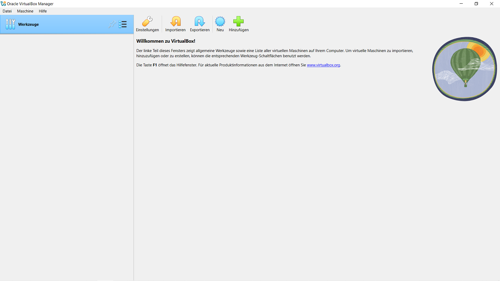

## Was ist eine VirtualBox?
Eine VirtualBox ist ein Programm, mit dem du auf deinem Computer virtuelle Maschinen erstellen und betreiben kannst. Das bedeutet, du kannst ein komplettes Betriebssystem (wie Windows, Linux oder macOS) innerhalb deines aktuellen Betriebssystems laufen lassen, ohne dass du einen zweiten Computer benötigst. Es ist wie ein Computer im Computer

## Einrichtung einer VirtualBox

1. **Neue virtuelle Maschine erstellen**:
   - Öffne VirtualBox und klicke auf "Neu".
   - Gib deiner virtuellen Maschine einen Namen, z.B. "LinuxTest".
   - Binde unter ISO-Abbild deine eigene ISO-Datei ein.
   - Wähle "Linux" als Typ und "Ubuntu (64-bit)" als Version.
   
   
2. **Speicher (RAM) und Prozessoren (CPU) festlegen**:
   - Wähle, wie viel Arbeitsspeicher (RAM) du der virtuellen Maschine geben möchtest. 2 GB (2048 MB) sind ein guter Start.
   - Wähle, wie viele Prozessoren (CPU) du der virtuellen Maschine geben möchtest. 2 CPUs
   sind ein guter Start.![[Virtual03.png]]

3. **Virtuelle Festplatte erstellen**:
   - Wähle "Jetzt eine virtuelle Festplatte erstellen".
   - Wähle "VDI (VirtualBox Disk Image)" als Festplattentyp.
   - Wähle "Dynamisch alloziert", damit die Festplatte nur so viel Platz auf deinem echten Computer belegt, wie sie tatsächlich braucht.
   - Lege die Größe der Festplatte fest, z.B. 20 GB.

4. **Virtuelle Maschine starten**:
   - Klicke auf "Starten", um die virtuelle Maschine zu starten.
   - Die Installation von Linux sollte beginnen. Folge den Anweisungen auf dem Bildschirm, um Linux zu installieren.

5. **Gast-Erweiterungen installieren** (optional, aber hilfreich):
   - Nach der Installation von Linux, gehe zu "Geräte" in der VirtualBox-Menüleiste und wähle "Gasterweiterungen einlegen".
   - Folge den Anweisungen zur Installation der Gasterweiterungen. Diese verbessern die Leistung und Integration von Linux in VirtualBox.
