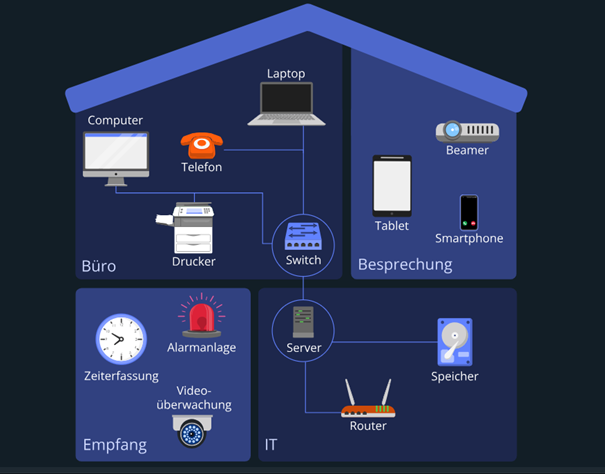

---
tags:
- Netzwerk
- Netzwerkgeräte
- Einführung
---

# Übersicht der gängigen Netzwerkgerät und Begriffe 

## Aktive Netzwerkkomponenten
### 1. Router
**Funktion:** Ein Router ist dafür zuständig, mehrere Netzwerke miteinander zu verbinden und ankommende Datenpakete weiterzuleiten. 
Hierbei werden verschiedene Kriterien berücksichtigt, um die geeignetste Route zum Zielrechner auszuwählen.
Insbesondere verbindet ein Router Heimnetzwerke mit dem Internet.
Im Gegensatz zum Switch basiert beim Router die Weiterleitungsentscheidung nicht auf den MAC-Adressen, sondern auf den sogenannten IP-Adressen.

**Beispiel:** Heimrouter, die Internetzugang für verschiedene Geräte bereitstellen.

### 2. Switch
**Funktion:** Ein Switch ist eine Art Umschalter, der dafür sorgt, dass die Daten zielgerichtet an den gewünschten Empfänger weitergeleitet werden. 
Dazu werden die ankommenden Datenpakete untersucht und basierend auf der MAC-Adresse des Empfängers entsprechend weitergeleitet.

**Beispiel:** Ethernet-Switch in einem Büro.

### 3. Access Point (AP)
**Funktion:** Ein Wireless Access Point (WAP), ist ein Hardwaregerät, das dazu dient, mobile Endgeräte (Handys, Notebooks usw.) über ein WLAN (Wireless Local Area Network) 
mit einem LAN (Local Area Network), also einem kabelgebundenen Datennetz, zu verbinden. Somit fungiert ein WAP als Schnittstelle für kabellose Kommunikationsgeräte.
Verglichen mit einem Router kann ein WAP nicht entscheiden, wohin Datenpakete am besten weitergeleitet werden. Somit ist ein WAP lediglich eine kabellose Alternative, 
um Endgeräten eine drahtlose Verbindung zu einem Netzwerk zu ermöglichen. Zusätzlich erlaubt ein Router eine viel kleinere Teilnehmeranzahl als ein WAP.

### 4. Repeater
**Funktion:** Da Signale räumlich begrenzt sind, verlieren sie bei größeren Distanzen an Stärke. Deshalb benutzt man Repeater, um deren Reichweite zu vergrößern. 
Hierbei werden die elektrischen bzw. optischen Signale aufbereitet und weitergesendet.
Eine andere Funktion von Repeatern ist das Entfernen von Signalstörungen (Rauschen, Verzerrungen usw.), die bei einer digitalen Datenübertragung gelegentlich vorkommen.

### 6. Firewall
**Funktion:** Überwacht und kontrolliert den ein- und ausgehenden Netzwerkverkehr basierend auf vordefinierten Sicherheitsregeln.
**Beispiel:** Hardware- oder Software-Firewall zum Schutz eines Unternehmensnetzwerks.

### 7. Network Interface Card (NIC)
**Funktion:** Ermöglicht einem Gerät, sich mit einem Netzwerk zu verbinden. Kann kabelgebunden (Ethernet) oder kabellos (WLAN) sein.
**Beispiel:** Netzwerkkarten in PCs und Laptops.

## Passive Netzwerkkomponenten
### 1. Steckverbinder (Patch-Kabel)
**Funktion:** Ein Steckverbinder ist ein Verbindungselement, das zum Trennen und Verbinden von elektrischen und optischen Leitungen dient. Lichtwellenleiter (Glasfaser) oder Kupfer.

### 2. Patch-Felder
**Funktion:** Ein Patchfeld, auch Rangierfeld genannt, ist ein Verbindungselement für Kabel, das aus vielen durchnummerierten Ports besteht. 
Hiermit werden Verlegekabel an einer zentralen Stelle zusammengeführt, um bei komplexen Kabelstrukturen den Überblick zu behalten.

## Wichtige Begriffe
### 1. IP-Adresse
**Funktion:** Eine Adresse, die einem Gerät in einem Netzwerk **zugewiesen** wird.

### 2. DNS (Domain Name Server)
**Funktion:** Wandelt Domainnamen in IP-Adressen um.

### 3. DHCP (Dynamic Host Configuration Protocol)
**Funktion:** Zuweisung von IP-Adressen und anderen Netzwerkeinstellungen an Geräte im Netzwerk. Im Gegensatz zur statischen Vergabe von IP-Adressen, läuft hier alles automatisch ab.

### 4. VLAN (Virtual Local Area Network)
**Funktion:** Ermöglicht die Trennung von Netzwerken innerhalb der gleichen physikalischen Infrastruktur.

### 5. MAC-Adresse (Media-Access-Control-Adresse)
**Funktion:** Ist die **eindeutig identifizierbare** Nummer eines Geräts auf einer Datenverbindung. Anhand dieser Nummer werden über die Verbindung laufende Daten den Geräten zugeordnet.

### 6. VPN (Virtual Private Network)
**Funktion:** Stellt eine sichere Verbindung über ein öffentliches Netzwerk her, sodass Daten privat übertragen werden.
**Beispiel:** Zugriff auf ein Unternehmensnetzwerk von zu Hause aus.

### 7. Subnetz
**Funktion:** Ein Teil eines größeren Netzwerks, der durch eine Subnetzmaske definiert wird. Ermöglicht die Organisation und Verwaltung von IP-Adressen.

### 8. Client-Server-Model
**Funktion:** Beschreibt die Interaktion zwischen Client (bsp. Desktop-PC zuhause) und Server. Der Client sendet eine Anfrage an der Server. Der Server empfängt und verarbeitet die Anfrage. Dann wird die Anfrage weiter verarbeitet und schließlich die Antwort 
zurück an den Client gesendet.
**Beispiel:** Stell dir vor du möchtest eine Webseite besuchen. Du gibst die URL in deinen Webbrowser ein (Client). Der Browser sendet eine Anfrage an den Webserver, der die Webseite hostet. Der Webserver empfängt die Anfrage, findet die angeforderte Seite und sendet sie zurück an den Brwoser. Schließlich zeigt dein Browser die Webseite an.

### 9. MESH-Netzwerk
**Funktion:** Ein MESH-Netzwerk ist eine Art von Netzwerk, bei dem mehrere Geräte (sogenannte Knoten) miteinander verbunden sind, um eine nahtlose und weitreichende Abdeckung zu gewährleisten.

